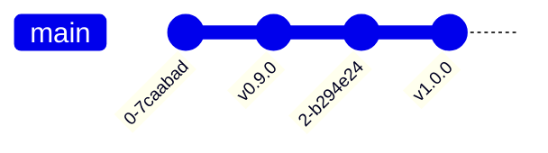
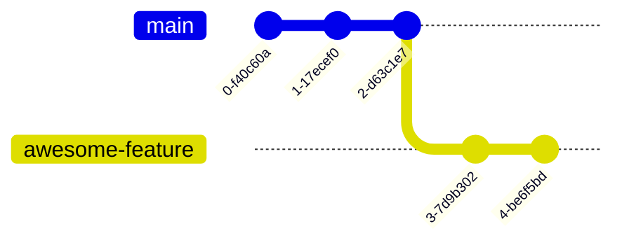
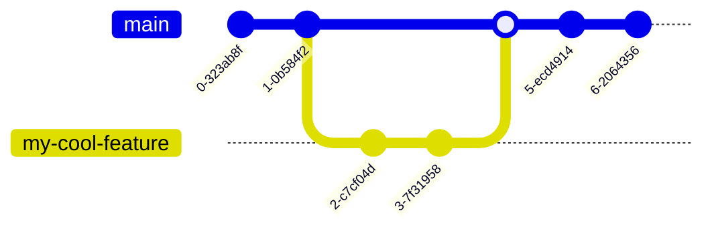

```yaml
layout: image-right
image: /gitxkcd.png
```

<div class="center h-full grid place-content-center text-lg">
<div class="text-8xl"><i>Git</i>ing started </div>
</div>

::caption::
If that doesn't fix it, git.txt contains the phone number of a friend of mine who understands git. Just wait through a few minutes of 'It's really pretty simple, just think of branches as...' and eventually you'll learn the commands that will fix everything.

---

```yaml
layout: center
```

# What Do I Download?

- [Git](https://git-scm.com/downloads) or through package manager (`brew install git`)
- Optional: [Github Desktop](https://desktop.github.com/download/) or other [GUI client](https://git-scm.com/downloads/guis)

---

```yaml
layout: two-cols
```

# Commits

- Basic unit of a git repo

```shell
git init # initializes git
git add . # tells git what to commit (everything)
git commit -m "my commit message" # creates commit
```

- Each commit is a reference to the difference
  from the last commit
- Some commits can have special names, called tags

::right::

<div class="center h-full grid place-content-center text-lg">



</div>

---

```yaml
layout: two-cols
```

# Diffs

- To see differences between commits, one can check the diff

```shell
git init # need to run once for each project
echo "hiya world" > README.md # adds hiya world to README
git commit -m "first commit"
echo "hello world" > README.md # rewrites hiya world to hello world
git diff
```

```diff
diff --git a/README.md b/README.md
index d1594c9..3b18e51 100644
--- a/README.md
+++ b/README.md
@@ -1 +1 @@
-hiya world
+hello world
```

::right::

# Status

- Check which files are modified with `git status `

```shell
git status
```

```
On branch master
Changes not staged for commit:
  (use "git add <file>..." to update what will be committed)
  (use "git restore <file>..." to discard changes in working directory)
	modified:   README.md

no changes added to commit (use "git add" and/or "git commit -a")
```

---

```yaml
layout: two-cols
```

# Branches

<v-clicks>

- Branches make it easy to organize commits

- Typically represent features

</v-clicks>

<v-clicks>

```shell
git branch awesome-feature
git switch awesome-feature
# or
git switch -c awesome-feature
# or
git checkout -B awesome-feature # no longer recommended
```

</v-clicks>

<v-clicks>



- Once feature is complete, the branch is _merged_ into main

</v-clicks>

::right::

<v-clicks>

```shell
git switch main
git merge awesome-feature
```


- Many repos do not directly commit to main, only merge from other branches via _pull requests_.

</v-clicks>

---

```yaml
layout: two-cols
```

# Merge Conflicts

<v-clicks>

- The price we pay for branches
- When branches have commits that point to the same files
  as commits on the main branch during a merge, then a merge conflict can occur
- Branches actually prevent another type of merge conflict covered later

</v-clicks>

```diff
diff --git a/main.py b/main.py
index 157e0f8..84c5310 100644
--- a/main.py
+++ b/main.py
@@ -1,5 +1,8 @@
+<<<<<<< HEAD
+=======
 def time_travel():
     pass

 def AGI():
     pass
+>>>>>>> my-cool-feature

```

::right::


<SlidevVideo  autoplay loop width=75%>
<source src="/merge-conflict.mp4" type="video/mp4" />
</SlidevVideo>

---

```yaml
layout: two-cols-header
```

## Avoiding merge conflicts

- Merge conflicts can always be avoided when working alone
- Only create a few feature branches at a time (1 is best)
- Always merge in main before creating another commit

::left::

<h1 style="text-align: center;" > <span v-mark="{color: 'green'}"> Good </span>  </h1>



::right::

<h1 style="text-align: center;" > <span v-mark="{color: 'red'}"> Bad </span>  </h1>


---

```yaml
layout: two-cols
```

## Resolving Merge Conflicts

- Git needs to be told how to resolve these conflicts
- Simply edit the offending files to pick the commit you want
- Then create a commit with the resolution

<SlidevVideo  autoplay loop width=100%>
<source src="/resolve-conflict.mp4" type="video/mp4" />
</SlidevVideo>

::right::

```bash
git merge my-cool-feature
```

```
Auto-merging main.py
CONFLICT (content): Merge conflict in main.py
Automatic merge failed; fix conflicts and then commit the result.
```

```bash
git merge my-cool-feature
```

```
error: Merging is not possible because you have unmerged files.
hint: Fix them up in the work tree, and then use 'git add/rm <file>'
hint: as appropriate to mark resolution and make a commit.
fatal: Exiting because of an unresolved conflict.
```
