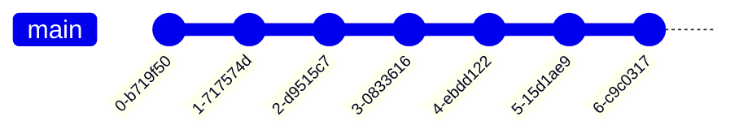
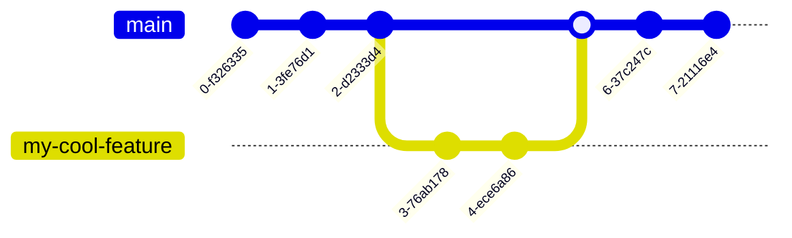

# GitHub

A hosting service for git repositories or repos

---

```yaml
layout: image-left
image: /github-repo.png
```

# Github Features

- GitHub (or any git hosting service) provides a place where a repository
  can be backed up
- Pull Requests provide a method to contribute to community projects asynchronously
- GitHub Actions can perform operations on the source code using a virtual machine
- Github Pages provide free website hosting services for static websites

---

```yaml
layout: cover
```

# Creating A Repository

---

```yaml
layout: center
```

<SlidevVideo  autoplay>
<source src="/create-repo.mp4" type="video/mp4" />
</SlidevVideo>

---

```yaml
layout: image-right
image: create-repo.png
class: center
```

# Getting the repo

```shell
git clone https://github.com/IllustratedMan-code/my-cool-repo.git
```

<SlidevVideo autoplay width=100%>

<source src="/cloning.mp4" type="video/mp4" />
</SlidevVideo>

---

```yaml
layout: image-right
image: /first-commit.png
```

# Your First Commit

<SlidevVideo autoplay width=100%>

<source src="/first-commit.mp4" type="video/mp4" />
</SlidevVideo>

---

```yaml
layout: cover
```

# Pull Requests

Enabling Asynchronous Collaboration

---

```yaml
layout: center
```



<!--
In basic a basic git history like this one, it is very difficult for multiple people,
or someone on multiple computers to avoid merge conflicts.
-->

---

```yaml
layout: center
```



<v-clicks>

- Branches prevent merge conflicts from occuring
- How can branches be merged asynchronously?
- With Pull Requests!

</v-clicks>

<!--
By creating branches, it makes it easier to prevent merge conflicts and allow multiple people to create branches. This way multiple people can
-->
