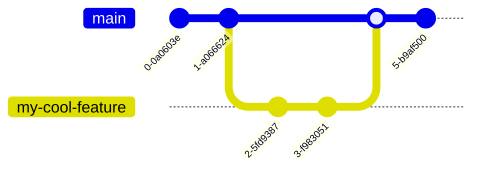

<div class="center h-full grid place-content-center text-lg">
<div class="text-5xl" > GitHub </div>

A hosting service for git repositories or repos

</div>

---

```yaml
layout: image-left
image: /github-repo.png
```

# Github Features

- GitHub (or any git hosting service) provides a place where a repository
  can be backed up
- Pull Requests provide a method to contribute to community projects asynchronously
- GitHub Actions can perform operations on the source code using a virtual machine
- Github Pages provide free website hosting services for static websites

---

```yaml
layout: cover
```

# Creating A Repository

---

```yaml
layout: center
```

<SlidevVideo  autoplay loop>
<source src="/create-repo.mp4" type="video/mp4" />
</SlidevVideo>

---

```yaml
layout: image-right
image: create-repo.png
class: center
```

# Getting the repo

```shell
git clone https://github.com/IllustratedMan-code/my-cool-repo.git
```

- No need to `git init`

<SlidevVideo autoplay loop width=100%>

<source src="/cloning.mp4" type="video/mp4" />
</SlidevVideo>

---

```yaml
layout: image-right
image: /first-commit.png
```

# Your First Commit

```shell
git add .
git commit -m "my first commit"
git push # pushes the commit to the repo on github
```

<SlidevVideo autoplay loop width=100%>

<source src="/first-commit.mp4" type="video/mp4" />
</SlidevVideo>

---

# Remote Merge conflicts and git pull

- Merge conflicts can occur when attempting to pull changes from GitHub
- If a change is made to the remote repo, then local commits can conflict with
  remote commits, creating a conflict
- `git pull` attempts to merge the most recent remote changes into the local repository

### Typical Scenario

- A change is made to the remote (github), either by you or someone else
- A local commit is made by you and pushed to the remote `git commit && git push`
- The push is rejected, git tells you to run `git pull` first
- You try to run git pull, but to your dismay, a merge conflict has occured
  and the remote changes cannot be merged with your local changes

---

```yaml
layout: two-cols
```

# Pull Requests

<v-clicks>

- Branches prevent merge conflicts from occuring when multiple people are working on a project
- How can branches be merged asynchronously?
- With Pull Requests!

</v-clicks>

::right::

## No branches


## Branches



<!--
In basic a basic git history like this one, it is very difficult for multiple people,
or someone on multiple computers to avoid merge conflicts.

By creating branches, it makes it easier to prevent merge conflicts and allow multiple people to create branches. This way multiple people can work asynchronously on different branches.
-->

---

```yaml
layout: two-cols
```

# Creating a pull request

```bash
git switch -c my-cool-feature
vim my-cool-feature.py # add some features
git commit -m "my-cool-feature"
git push --set-upstream origin my-cool-feature # adds branch to github
```

 </img>

::right::

<SlidevVideo  autoplay loop>
<source src="/pull-request.mp4" type="video/mp4" />
</SlidevVideo>

---

# Resolving pull conflicts

```bash
git pull
```

```
hint: You have divergent branches and need to specify how to reconcile them.
hint: You can do so by running one of the following commands sometime before
hint: your next pull:
hint:
hint:   git config pull.rebase false  # merge
hint:   git config pull.rebase true   # rebase
hint:   git config pull.ff only       # fast-forward only
hint:
hint: You can replace "git config" with "git config --global" to set a default
hint: preference for all repositories. You can also pass --rebase, --no-rebase,
hint: or --ff-only on the command line to override the configured default per
hint: invocation.
fatal: Need to specify how to reconcile divergent branches.
```

```bash
git config pull.rebase false
git pull
```

```
Auto-merging main.py
CONFLICT (content): Merge conflict in main.py
Automatic merge failed; fix conflicts and then commit the result.
```

---

# Resolving pull conflicts

- simply use the merge conflict resolution procedure covered earlier!

<SlidevVideo  autoplay loop width=70%>
<source src="/resolve-pull-conflict.mp4" type="video/mp4" />
</SlidevVideo>

---

# Creating a Github personal access token

- Depending on how git is used, you may need to create a github personal access token [See this guide](https://docs.github.com/en/authentication/keeping-your-account-and-data-secure/managing-your-personal-access-tokens)
- Personal access tokens can be used in place of passwords.

To store the username and password for the computer, run this command:

```bash
git config --global credential.helper store
```

Then, then next time git asks for authentication, use the personal access token instead of a password.
